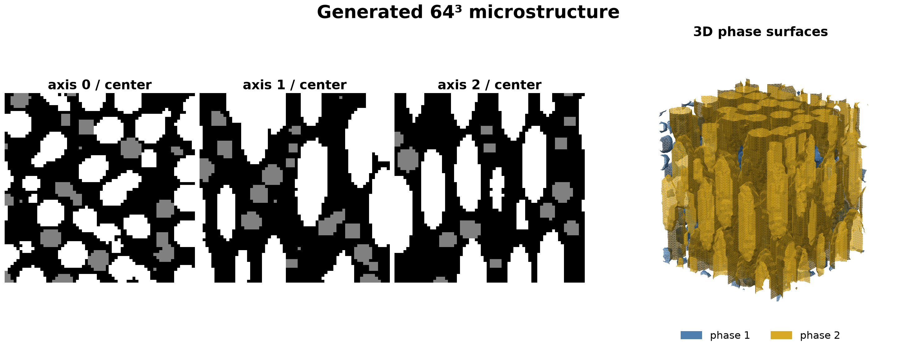
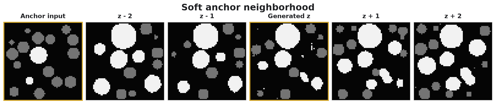
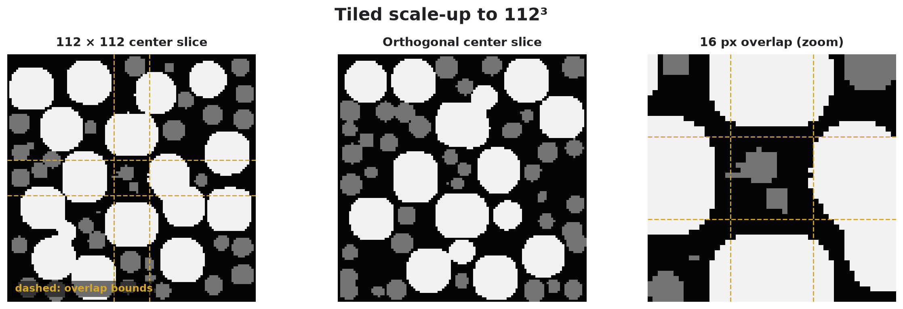

# A2S3D: Anisotropy-Aware, Anchored, and Scalable Multi-Plane Diffusion for 2D-to-3D Microstructure Generation

A2S3D is an end-to-end categorical image-space diffusion pipeline for 2D-to-3D microstructure generation.
It learns directly from labeled 2D slices along three spatial axes and generates a categorical 3D volume in the same representation, without an intermediate latent autoencoder or 3D reconstruction network.
Axis-specific conditioning preserves directional differences between the training distributions, allowing anisotropic microstructures to be represented rather than averaging their statistics across orientations.

The method extends the [Micro3Diff framework](https://doi.org/10.1038/s41524-024-01280-z).
During generation, one axis-conditioned denoiser alternates between orthogonal planes of a shared 3D noise volume.
Harmonized re-noising and denoising keep the evolving volume compatible with the learned axis-wise slice distributions.

Its main contributions are anisotropy-aware axis conditioning, learned soft slice anchors, and overlapping-tile scale-up within one multi-plane diffusion process.
Phase-fraction conditioning and DDIM sampling provide additional control over composition and sampling cost.

## Generated examples

### Three-dimensional structure

Orthogonal center slices and phase surfaces from the same generated 64³ volume.
The background phase is omitted from the surface rendering; phase 1 is blue and phase 2 is gold.



### Soft anchor continuity

A labeled center slice provides local features throughout denoising without a hard overwrite of the final volume.
Neighboring slices remain generated, so phase boundaries and particles can evolve through the anchored plane.



### Tiled scale-up

A 112³ volume generated with overlapping 64 × 64 denoising tiles.
Dashed guides mark the overlap bounds in the center plane and the enlarged junction region.
The example uses 100 DDIM steps and ten harmonization passes.



## Method

### Problem

Let each training slice be a categorical field observed along axis `a ∈ {0, 1, 2}`:

```math
y_a \in \{0, \ldots, K-1\}^{H \times W}.
```

The goal is to sample a categorical volume

```math
V \in \{0, \ldots, K-1\}^{D \times H \times W}
```

whose slices resemble the corresponding axis-wise training distributions.

### Image-space categorical diffusion

Let `e_y` denote the one-hot encoding of a label image.
The centered diffusion input is

```math
x_0 = 2e_y - 1.
```

The forward DDPM process adds Gaussian noise:

```math
x_t =
\sqrt{\bar{\alpha}_t}\,x_0 +
\sqrt{1-\bar{\alpha}_t}\,\epsilon,
\qquad
\epsilon \sim \mathcal{N}(0,I).
```

A 2D U-Net predicts the injected noise, `ε_θ(x_t, t, c, a, A)`, conditioned on timestep `t`, phase fractions `c`, axis `a`, and optional anchor information `A`.
Training minimizes mean squared error between the sampled and predicted noise.
After sampling, the phase with the largest channel value is selected at every pixel or voxel:

```math
\hat{y} = \arg\max_k x^{(k)}.
```

Direct image-space diffusion exposes phase boundaries and particle geometry at the target resolution.

### Multi-plane dimensionality expansion

Sampling starts from one 3D Gaussian noise tensor `X_T`.
At each reverse step, the sampler:

1. chooses one of the three spatial axes;
2. views the shared volume as a batch of 2D planes;
3. denoises the planes using the matching axis condition; and
4. merges them back into the same 3D state.

For a slice operator `S_a` along axis `a`, one update can be written conceptually as

```math
X_{t'} =
S_a^{-1}
\left(
\mathcal{D}_{\theta,t\rightarrow t'}
\left(S_a(X_t), a\right)
\right),
```

where `t' = t - 1` for DDPM and may skip steps for DDIM.
The axis rotates over successive reverse steps.
Because all axes update the same tensor, changes made from one view become input to later views.

### Anisotropy-aware axis conditioning

Microstructures may exhibit different statistics along different spatial directions.
A2S3D preserves these directional differences by assigning each training image an axis condition `0`, `1`, or `2`.

A learned axis embedding is added to the timestep and phase-fraction embeddings, allowing one U-Net to learn a distinct slice distribution for each direction.
During 3D generation, each plane is denoised using its corresponding axis condition instead of treating all orientations as interchangeable.

This axis-aware formulation represents anisotropy observed in the 2D training data, although it does not guarantee a unique or globally consistent anisotropic 3D structure.

### Soft slice anchors

An anchor consists of a labeled image and a binary spatial mask.
During training, masks are sampled as empty regions, lines, segments, rectangles, full images, or multiple lines.
The clean anchor and mask are passed through a dedicated multi-scale encoder.
Its local features are added to matching U-Net encoder levels near the supported region.

The anchor encoder is always part of the model, while empty masks train the unanchored path.
`anchor_loss_weight` can place additional noise-prediction weight around anchored regions.
At inference, anchor features condition every reverse step, but the final labels are still produced by the denoiser rather than copied from the input.

Multiple anchor slices can be combined; duplicate planes and conflicting intersections are rejected before sampling.

### Tiled scale-up

The basic multi-plane construction uses a cubic volume whose side length matches the 2D model resolution.
For larger volumes, each plane is split into overlapping training-size tiles.
Predicted noise is merged with a smooth window:

```math
\hat{\epsilon}(p) =
\frac{\sum_i w_i(p)\,\hat{\epsilon}_i(p)}
{\sum_i w_i(p)}.
```

Overlap reduces discontinuities at tile boundaries and permits larger volumes without retraining.
This assumes that the microstructure is locally stationary.
Correlations, connected structures, or directional patterns longer than one tile are not explicitly modeled by overlap alone.

### Harmonization and DDIM

One plane update may not move the current state close enough to the learned 2D distribution.
Harmonization repeats denoising and re-noising at the same schedule step before moving on.
`harmonization_steps` controls this repetition.

A larger value requires more denoiser evaluations and can strengthen the selected plane prior, but quality is not guaranteed to improve monotonically.
DDIM reduces the number of reverse steps by connecting selected cumulative alpha states deterministically.
`ddim_steps` and `harmonization_steps` trade sampling cost against plane-wise refinement.

## Additional conditioning

### Phase fractions

The phase-fraction vector

```math
c \in \Delta^{K-1}
```

is embedded and added to the timestep embedding.
During training, some vectors are replaced by a learned null condition.
This enables classifier-free guidance:

```math
\hat{\epsilon} =
\epsilon_\theta(x_t,t,\varnothing,a)
+ s\left[
\epsilon_\theta(x_t,t,c,a)
- \epsilon_\theta(x_t,t,\varnothing,a)
\right].
```

The condition changes the denoising direction but is not a hard volume constraint.
Final fractions may differ from the target and depend on the training distribution, volume size, anchors, and guidance scale.

## Scope and limitations

1. A set of 2D slice distributions does not uniquely determine a 3D joint distribution.
2. Realistic slices do not guarantee correct 3D connectivity, topology, or physical properties.
3. Axis conditioning represents directional slice statistics, but does not guarantee a globally consistent anisotropic 3D structure.
4. Final argmax conversion is discontinuous and can change boundaries when channel scores are close.

Useful 2D checks include phase fractions, particle-size distributions, circularity, interface length, and two-point correlations.
Useful 3D checks include connected components, interfacial area, directional correlations, percolation, and property-based metrics.
These evaluation metrics are outside the current core package.

## Quick start

```powershell
python -m pip install -r requirements.txt
python gen_data.py
python run_train.py
```

Simulation, training, and prediction are configured in `config/simul.yaml`, `config/model.yaml`, and `config/predict.yaml`.
Generated training slices are stored by axis:

```yaml
data_dir:
  0: ../data/generated/train/0
  1: ../data/generated/train/1
  2: ../data/generated/train/2
```

Input images must contain integer phase labels from `0` to `K - 1`.
Intensity images can instead be segmented by enabling `segment`.
Axis datasets are sampled with equal probability, independent of their image counts.

Checkpoints are written to `run/<timestamp>/weight/mpdd/`.
A volume can be generated from a trained run as follows:

```python
from src.predict import load_predict_config, load_predictor

cfg = load_predict_config("config/predict.yaml")
pred = load_predictor(cfg.run_dir)
opts = cfg.make_options(pred)
vol, stats = pred.predict(opts)
```

`vol` is a `uint8` tensor with shape `[D, H, W]`.
The notebooks cover axis-wise data inspection, independent 2D sampling, anchored 3D generation, and tiled scale-up.

## Tests

```powershell
.venv\Scripts\python.exe -m pytest -q
```

## References

- [Micro3Diff: multi-plane denoising diffusion with harmonized sampling](https://doi.org/10.1038/s41524-024-01280-z)
- [Micro3Diff preprint](https://arxiv.org/abs/2308.14035)
- [Denoising Diffusion Probabilistic Models](https://arxiv.org/abs/2006.11239)
- [Denoising Diffusion Implicit Models](https://arxiv.org/abs/2010.02502)
